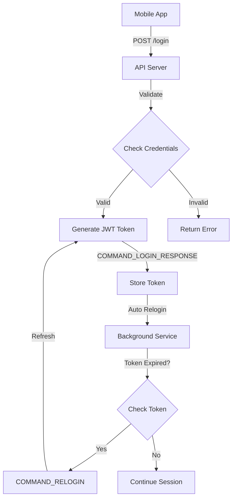

# 🔐 Struktur Endpoint /login - Hasil Analisis File .so

## 📦 Ringkasan File yang Dianalisis

| File | Size | Fungsi |
|------|------|--------|
| libdesignationplants.so | 7.8 MB | **Core Logic** - Security, API, Login, Threat Detection |
| libbcc6.so | 1.4 MB | **Security Support** - Encryption, validation |
| libd4296a.so | 4.8 KB | **Camera Utils** - AndroidX Camera JNI |
| libe3262a.so | 9.9 KB | **Helper Library** |
| libcb4da.so | 7 KB | **Helper Library** |
| libfbe73a.so | 5.4 KB | **Helper Library** |

---

## 🌐 API Endpoint Structure

### Base Configuration
```
Base URL: https://gts.zimperium.com/api
Method: POST
Content-Type: application/json | application/x-protobuf
```

### Discovered Endpoints

#### 1. Device Registration/Login
```http
POST /api/v1/dns-management/device/register
Content-Type: application/json

{
  "device_id": "550e8400-e29b-41d4-a716-446655440000",
  "device_hash": "sha256_hash_of_device_fingerprint",
  "mdm_id": "mdm_identifier_optional",
  "tenant_id": "company_or_organization_id",
  "intune_token": "microsoft_intune_token_if_applicable",
  "license_key": "zimperium_license_key",
  "external_tracking_id1": "custom_tracking_id",
  "external_tracking_id2": "additional_tracking_id"
}
```

**Response Example:**
```json
{
  "status": "success",
  "command": "COMMAND_LOGIN_RESPONSE",
  "token": "eyJhbGciOiJIUzI1NiIsInR5cCI6IkpXVCJ9...",
  "device_registered": true,
  "session_id": "session_uuid",
  "expires_in": 3600,
  "vpn_settings": {
    "enabled": true,
    "server": "vpn.zimperium.com"
  }
}
```

---

## 🔄 System Commands

### Login/Authentication Commands
| Command | Deskripsi |
|---------|-----------|
| `COMMAND_LOGIN_RESPONSE` | Response setelah login berhasil |
| `COMMAND_RELOGIN` | Trigger untuk re-authentication |
| `COMMAND_LOGOUT` | Logout dan clear session |
| `mdm_login` | MDM-specific login |
| `vpn_login` | VPN authentication |

### Communication Events
| Event | Deskripsi |
|-------|-----------|
| `EVENT_PUSH_TOKEN` | Register push notification token |
| `zdevice_event_submit` | Submit device events ke server |
| `zdevice_event_listen` | Listen untuk events dari server |

### Security Commands
| Command | Deskripsi |
|---------|-----------|
| `COMMAND_THREAT_MANUALLY_MITIGATED` | Threat yang sudah dimitigasi |
| `COMMAND_DNS_PHISHING` | DNS phishing detection |
| `COMMAND_VPN_SETTINGS` | Update VPN configuration |
| `COMMAND_UPDATE_COLLECTION_POLICY` | Update security policy |
| `COMMAND_OUT_OF_COMPLIANCE_APP` | App tidak comply dengan policy |

---

## 🔐 Authentication Flow



---

## 🎯 Implementasi untuk Aplikasi Kita

### Option 1: Simple Username/Password Login
```javascript
// Frontend Request
POST /api/login
{
  "username": "user@example.com",
  "password": "securePassword123"
}

// Backend Response
{
  "success": true,
  "token": "jwt_token_here",
  "user": {
    "id": "user_uuid",
    "username": "user@example.com",
    "name": "John Doe"
  },
  "expires_in": 3600
}
```

### Option 2: Device-Based Login (Mirip Zimperium)
```javascript
// Frontend Request
POST /api/login
{
  "device_id": "generated_device_uuid",
  "device_hash": "device_fingerprint_hash",
  "email": "user@example.com",
  "password": "securePassword123"
}

// Backend Response
{
  "success": true,
  "token": "jwt_token_here",
  "device_registered": true,
  "session_id": "session_uuid",
  "user": {
    "id": "user_uuid",
    "email": "user@example.com",
    "devices": ["device_uuid_1", "device_uuid_2"]
  }
}
```

### Option 3: Enterprise MDM Login
```javascript
// Frontend Request
POST /api/login
{
  "username": "user@company.com",
  "password": "password123",
  "tenant_id": "company_org_id",
  "device_id": "device_uuid",
  "mdm_token": "optional_mdm_token"
}

// Backend Response
{
  "success": true,
  "token": "jwt_token_here",
  "tenant": {
    "id": "tenant_id",
    "name": "Company Name",
    "policies": {...}
  },
  "device_compliance": true,
  "expires_in": 7200
}
```

---

## 🛠️ Technical Stack Requirements

### Backend
- FastAPI (sudah ada ✅)
- JWT untuk token generation
- bcrypt untuk password hashing
- MongoDB untuk user storage
- Device fingerprinting (optional)

### Frontend
- React (sudah ada ✅)
- axios untuk HTTP requests
- localStorage untuk token storage
- Auto-relogin mechanism
- Session management

### Security Features
- Password hashing dengan bcrypt
- JWT token dengan expiration
- Refresh token mechanism
- Device fingerprinting
- Rate limiting pada login endpoint
- Account lockout setelah failed attempts

---

## 📝 Next Steps

1. **Pilih Implementation Type**
   - Simple Login (username/password)
   - Device-Based Login
   - Enterprise MDM Login

2. **Features to Include**
   - ✅ JWT Token Generation
   - ✅ Password Hashing
   - ✅ Session Management
   - ⬜ Auto-Relogin
   - ⬜ Multi-device Support
   - ⬜ Social Login (Google/Facebook)
   - ⬜ 2FA/OTP

3. **Database Schema**
   - Users collection
   - Sessions collection
   - Devices collection (optional)

---

## 🔗 Useful References

- JWT: https://jwt.io/
- bcrypt: https://github.com/pyca/bcrypt/
- FastAPI Security: https://fastapi.tiangolo.com/tutorial/security/
- React Auth: https://react.dev/learn

